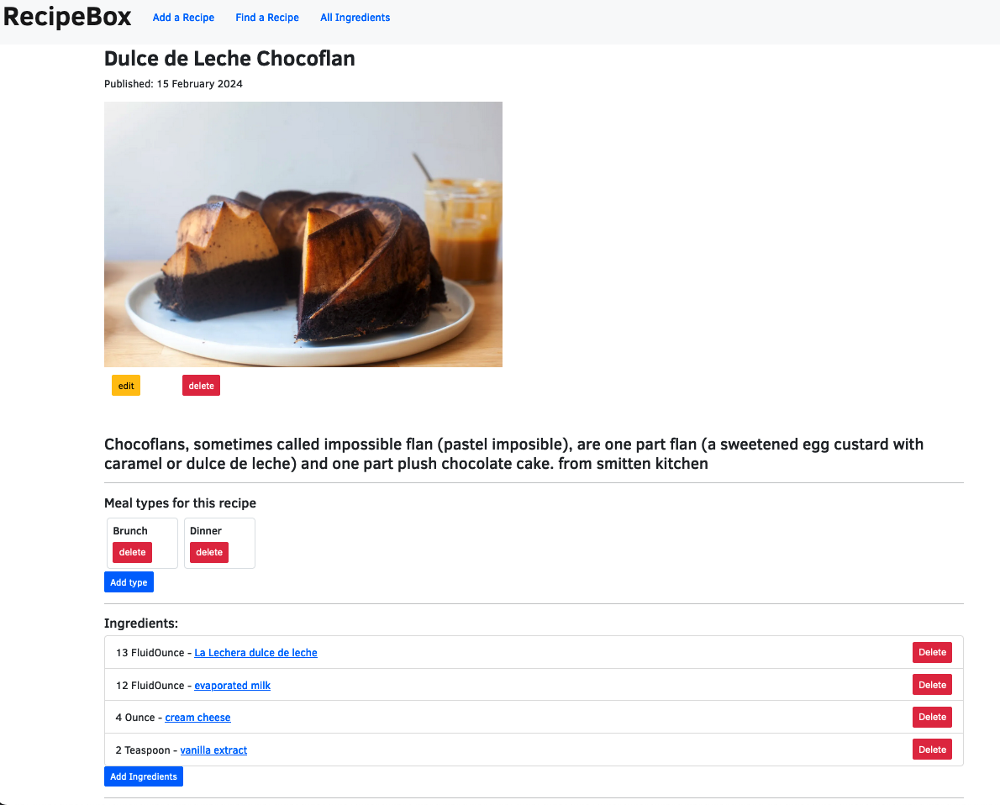

# RecipeBox

A web application for users to keep track of recipes, built with C#, using EFCore, Identity & MVC structure and a MySQL database.

By Ravin Fisher, Henry Oberholtzer, Kim Robinson

## Technologies Used

- C#
- MySQL
- EFCore




## User Stories

* As a user, I want to rate my recipes, so I know which ones are the best.

* Add tags to recipes: GF, VEGAN ETC

* As a user, I want to add a recipe with ingredients and instructions, so I remember how to prepare my favorite dishes.

* As a user, I want to tag my recipes with different categories, so recipes are easier to find. A recipe can have many tags and a tag can have many recipes.

* As a user, I want to be able to update and delete tags (Meals), so I can have flexibility with how I categorize recipes.

* As a user, I want to edit my recipes, so I can make improvements or corrections to my recipes.

* As a user, I want to be able to delete recipes I don't like or use, so I don't have to see them as choices.
   
* As a user, I want to see all recipes that use a certain ingredient, so I can more easily find recipes for the ingredients I have.

## Authentication:

    As a user, I want to create an account.
    As a user, I want to be able to log in and log off.
    As a user, I want to be able to see my account details.

Add authorization:

     As a user, I should only be able to create, update and delete if I am logged in. All users should be able to have read functionality.

## Stretch Goals
* If not signed in, can not leave comment
* Leaving comment attaches userName to comment
* As a user, I want to list my recipes by highest rated so I can see which ones I like the best (each recipe has rating average (details) sort recipes by ratings on recipes index page.)


## Setup/Installation Requirements

- .NET 6 or greater is required for set up, and dotnet-ef to manage migrations.
- To establish locally, [download the repository](https://github.com/henry-oberholtzer/RecipeBox/archive/refs/heads/main.zip) to your computer.
- Open the folder with your terminal and run `dotnet restore` to gather necessary resources.
- In the production direction, `/RecipeBox` run `$ touch appsettings.json`
- In `appsettings.json`, enter the following, replacing `USERNAME` and `PASSWORD` to match the settings of your local MySQL server.
  
```
{
    "ConnectionStrings": {
        "DefaultConnection": "Server=localhost;Port=3306;database=RecipeBox;uid=USERNAME;pwd=PASSWORD;"
    }
}
```
- A local instance of MySQL (8.0.0 or greater) is required to be set up and running to use the project, for information on installing and configuring MySQL, [please see the official documentation.](https://dev.mysql.com/doc/mysql-installation-excerpt/8.3/en/)
- If you do not have `dotnet-ef` installed, first install it by running `dotnet tool install --global dotnet-ef --version 6.0.0`
- Run `dotnet ef database update` to create the database based on the provided database migrations.
- To start the projet, in the production directory, run the command `dotnet run` on your terminal.

## Known Bugs
* When a user goes to add a Meal type to a recipe if they don't choose any checkboxes nothing happens. I want an error msg and to stay on that page.  Temp fix: Breakfast box is checked as default. Otherwise it redirects to the page but is no longer attached to the recipe by Id anymore and no error msg shows.


## License

(c) 2024 [Ravin Fisher](), [Kim Robinson](), [Henry Oberholtzer](https://www.henryoberholtzer.com/)

Original code licensed under the [GNU GPLv3](https://www.gnu.org/licenses/gpl-3.0.en.html#license), other code bases and libraries as stated.
